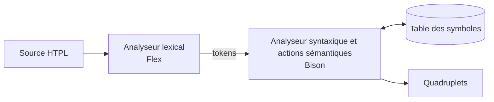

[English](README.md) | Français

<p align="center">
  
</p>

# Compilateur HTPL

HTPL est un petit langage pédagogique dont les programmes s'écrivent sous forme de balises de style XML : `<variables>` déclare des variables typées et des tableaux, `<instructions>` contient des affectations, des `if`/`else`, des `while` et des `print`. Ce dépôt contient un front-end de compilateur pour ce langage, écrit avec Flex et Bison. `htplc` lit un programme HTPL, vérifie sa syntaxe, remplit une table des symboles et produit du code intermédiaire sous forme de quadruplets.

## Un court programme HTPL

```htpl
<program>
<variables>
    <int name="counter">(3)</int>
</variables>
<instructions>
    <if condition=(counter >> 0)>
        <assign counter=(counter - 1)/>
    </if>
</instructions>
</program>
```

Les comparaisons s'écrivent `>>`, `<<`, `>>=`, `<<=` et `==`, car un `>` seul ferme une balise. La syntaxe complète se trouve dans la [référence du langage](docs/language.md) (en anglais).

## Chaîne de compilation



Tout se fait en une seule passe : l'analyseur syntaxique demande les tokens à l'analyseur lexical, et ses actions sémantiques mettent à jour la table des symboles et ajoutent des quadruplets à mesure que chaque construction est reconnue. La [note d'architecture](docs/architecture.md) (en anglais) explique les temporaires et la façon dont les sauts des `if`/`else` et des `while` sont complétés après coup (back-patching).

## Compiler et exécuter

Il faut flex, bison, gcc et make. Sous Ubuntu ou Debian :

```sh
sudo apt install flex bison gcc make
```

Sous Windows, installez [WSL](https://learn.microsoft.com/windows/wsl/install) avec Ubuntu et lancez tout à l'intérieur.

```sh
make          # compile htplc
make run      # compile examples/test.htpl avec htplc
make check    # compare la sortie avec examples/test.expected
make clean    # supprime htplc et les sources générées
```

`htplc` lit le programme sur l'entrée standard : pour compiler votre propre fichier, lancez `./htplc < program.htpl`.

## Exemple de sortie

`make run` affiche d'abord une trace de chaque token lu, puis les quadruplets. Cet extrait est la liste des quadruplets pour [examples/test.htpl](examples/test.htpl), copiée depuis [examples/test.expected](examples/test.expected) :

```text
=== Quadruplets ===
0- (:=, 3, , counter)
1- (:=, "Test", , message)
2- (Bounds, 1, 5, )
3- (ADEC, numbers, , )
4- (:=, 2, , numbers[1])
5- (:=, 1, , numbers[2])
6- (>, counter, 0, T0)
7- (BZ, 11, , T0)
8- (+, numbers[1], 1, T1)
9- (:=, T1, , numbers[2])
10- (BR, 7, , )
11- (==, counter, 0, T2)
12- (BZ, 18, , T2)
13- (-, 3, 1, T3)
14- (:=, T3, , counter)
15- (-, 4, 1, T4)
16- (:=, T4, , counter)
17- (BR, 22, , )
18- (+, counter, 1, T5)
19- (:=, T5, , counter)
20- (+, counter, 1, T6)
21- (:=, T6, , counter)
==================
```

Chaque ligne a la forme `index- (opérateur, opérande 1, opérande 2, résultat)`. `BZ` saute quand son opérande vaut zéro, `BR` saute sans condition, et `T0`, `T1`, ... sont des temporaires. Après la liste, `htplc` affiche `Parsing successful` puis la table des symboles.

## Étapes du projet

Le projet a été construit en trois étapes. Seule la dernière correspond au compilateur actuel.

| Étape | Dossier | Contenu |
| --- | --- | --- |
| 1 | [stages/01-lexer](stages/01-lexer/README.md) | Analyseur lexical Flex autonome qui écrit la liste des tokens dans un fichier |
| 2 | [stages/02-recursive-descent](stages/02-recursive-descent/README.md) | Analyseur syntaxique par descente récursive écrit à la main en C, pour la section `<variables>` |
| 3 (actuelle) | [src](src) | Compilateur Flex et Bison avec table des symboles et quadruplets, compilé sous le nom `htplc` |

## Limites actuelles

- La vérification des types ne couvre que les déclarations et les affectations, et les éléments de tableau ne sont vérifiés qu'en partie.
- Une boucle `while` ne réévalue pas sa condition : elle revient au test et saute le code qui calcule la condition.
- `print` ne génère aucun quadruplet.
- Les tampons ont une taille fixe : les champs d'un quadruplet contiennent 14 caractères, et un tableau garde au plus 10 éléments initiaux.

La liste complète, avec des exemples, se trouve dans la [référence du langage](docs/language.md#limitations).

## Documentation

- [Référence du langage](docs/language.md) (en anglais) : syntaxe, types, expressions et différences avec la spécification d'origine
- [Note d'architecture](docs/architecture.md) (en anglais) : table des symboles, quadruplets, back-patching
- Rapports d'origine, en français : [annexe du langage](docs/reports/Annexe%20langage.pdf) et [rapport d'analyse lexicale](docs/reports/Rapport%20analyse%20lexicale.pdf)

## Crédits

Projet de compilation, 2CS, filière SIL, ESI, 2024–2025

Équipe : Arabet Mohamed Ilyes, Bengherbia Abdelkarim, Bouacha Chamel Nadir, Mezenner Fares, Yekene Sofiane

**Ma contribution** (Chamel Nadir Bouacha) : conception et réalisation de l'analyse syntaxique, conception de la priorité des opérateurs pour les expressions arithmétiques, et conception d'ensemble du projet.
