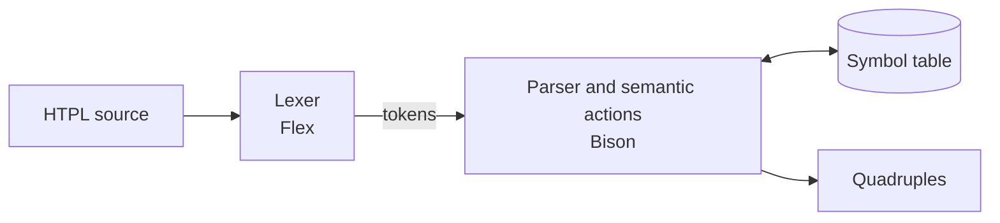

English | [Français](README.fr.md)

<p align="center">
  
</p>

# HTPL compiler

HTPL is a small teaching language whose programs are written as XML-style tags: `<variables>` declares typed variables and arrays, `<instructions>` holds assignments, `if`/`else`, `while` and `print`. This repository holds a compiler front end for it, built with Flex and Bison. `htplc` reads an HTPL program, checks its syntax, fills a symbol table, and emits intermediate code as quadruples.

## A short HTPL program

```htpl
<program>
<variables>
    <int name="counter">(3)</int>
</variables>
<instructions>
    <if condition=(counter >> 0)>
        <assign counter=(counter - 1)/>
    </if>
</instructions>
</program>
```

Comparisons are spelled `>>`, `<<`, `>>=`, `<<=` and `==`, because a single `>` closes a tag. The full syntax is in the [language reference](docs/language.md).

## Pipeline



Everything happens in a single pass: the parser pulls tokens from the lexer, and its semantic actions update the symbol table and append quadruples as each construct is recognised. The [architecture note](docs/architecture.md) covers temporaries and how jumps for `if`/`else` and `while` are back-patched.

## Build and run

You need flex, bison, gcc and make. On Ubuntu or Debian:

```sh
sudo apt install flex bison gcc make
```

On Windows, install [WSL](https://learn.microsoft.com/windows/wsl/install) with Ubuntu and run everything inside it.

```sh
make          # build htplc
make run      # compile examples/test.htpl
make check    # compare the output with examples/test.expected
make test-docs  # run the doc samples through htplc and check links (needs python3)
make clean    # remove htplc and the generated sources
```

`htplc` reads the program on standard input, so you can compile your own file with `./htplc < program.htpl`.

## Sample output

`make run` prints the quadruples, then `Parsing successful` and the symbol table (`./htplc -t` also prints every token as it is read). This excerpt is the quadruple listing for [examples/test.htpl](examples/test.htpl), copied from [examples/test.expected](examples/test.expected):

```text
=== Quadruplets ===
0- (:=, 3, , counter)
1- (:=, "Test", , message)
2- (Bounds, 1, 5, )
3- (ADEC, numbers, , )
4- (:=, 1, , numbers[1])
5- (:=, 2, , numbers[2])
6- (PRINT, "Counter initialized to 10", , )
7- (>, counter, 0, T0)
8- (BZ, 13, , T0)
9- (+, numbers[1], 1, T1)
10- (:=, T1, , numbers[2])
11- (PRINT, "Counter: + counter", , )
12- (BR, 7, , )
13- (==, counter, 0, T2)
14- (BZ, 20, , T2)
15- (-, 3, 1, T3)
16- (:=, T3, , counter)
17- (-, 4, 1, T4)
18- (:=, T4, , counter)
19- (BR, 24, , )
20- (+, counter, 1, T5)
21- (:=, T5, , counter)
22- (+, counter, 1, T6)
23- (:=, T6, , counter)
==================
```

Each line is `index- (operator, operand 1, operand 2, result)`. `BZ` jumps when its operand is zero, `BR` jumps unconditionally, `PRINT` outputs a value, and `T0`, `T1`, ... are temporaries.

## Project stages

The project was built in three steps. Only the last one is the current compiler.

| Stage | Folder | What it is |
| --- | --- | --- |
| 1 | [stages/01-lexer](stages/01-lexer/README.md) | Standalone Flex lexer that writes the token list to a file |
| 2 | [stages/02-recursive-descent](stages/02-recursive-descent/README.md) | Hand-written recursive-descent parser in C for the `<variables>` section |
| 3 (current) | [src](src) | Flex and Bison compiler with symbol table and quadruples, built as `htplc` |

## Current limitations

- Type checks look at the text of a value: any identifier passes for `int`, `float` and `boolean` targets, and array elements are not type-checked.
- Errors stop at the first one and point at the last token read.
- A program holds at most 1000 quadruples, and an array at most 10 initial elements.

The full list, with examples, is in the [language reference](docs/language.md#limitations).

## Documentation

- [Language reference](docs/language.md): syntax, types, expressions, and differences from the original spec
- [Architecture note](docs/architecture.md): symbol table, quadruples, back-patching
- Original reports, in French: [language annex](docs/reports/Annexe%20langage.pdf) and [lexical analysis report](docs/reports/Rapport%20analyse%20lexicale.pdf)

## Credits

Compilation project, 2CS, SIL track, ESI, 2024–2025

Team: Arabet Mohamed Ilyes, Bengherbia Abdelkarim, Bouacha Chamel Nadir, Mezenner Fares, Yekene Sofiane
