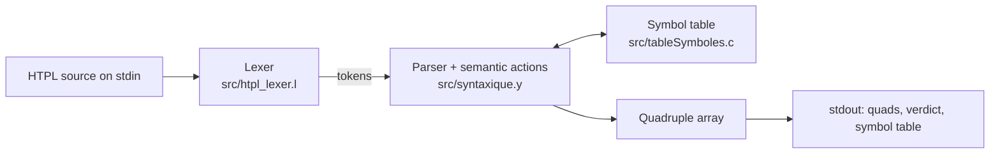

# Compiler architecture

This note explains how `htplc` turns an HTPL program into quadruples. It describes the code in [src/](../src) as it is, including its quirks. For the language itself, see the [language reference](language.md).

## Pipeline



There is a single pass. `main` in [src/syntaxique.y](../src/syntaxique.y) calls `yyparse`, which pulls tokens from the Flex lexer one at a time. The semantic actions attached to the grammar rules fill the symbol table and append quadruples as soon as each construct is recognised. When parsing succeeds, `main` prints the quadruple listing (`printQuad`), the line `Parsing successful`, and the symbol table (`printSymbolTable`).

The [Makefile](../Makefile) builds it in three steps, in this order:

1. `bison -d` turns `syntaxique.y` into `syntaxique.tab.c` and the token header `syntaxique.tab.h`.
2. `flex` turns `htpl_lexer.l` into `lex.yy.c`. It must run after Bison because the lexer includes `syntaxique.tab.h`.
3. `gcc` links both with `tableSymboles.c` into `htplc`.

`make check` runs `htplc < examples/test.htpl` and diffs the result against [examples/test.expected](../examples/test.expected). The quadruple examples below are taken from that file.

The two earlier milestones in [stages/](../stages) are separate programs: a standalone lexer ([stages/01-lexer](../stages/01-lexer/README.md)) and a hand-written recursive-descent parser ([stages/02-recursive-descent](../stages/02-recursive-descent/README.md)). `htplc` does not use them.

## Lexer

[src/htpl_lexer.l](../src/htpl_lexer.l) matches whole tag openings as single tokens: `<int`, `<assign`, `<if` and so on, plus closing tags such as `</int>` and `</if>`. Attribute syntax (`name`, `=`, string literals, parentheses) and expression operators are separate tokens. `>` is `TOKEN_END_TAG` and `/>` is `TOKEN_SELF_CLOSING_TAG`, which is why comparisons are spelled `>>`, `<<`, `>>=` and `<<=`.

Every rule that returns a token calls `token_action` first. The commented-out `main` at the bottom of the lexer used to open an output file; in `htplc` that file pointer (`output_file`) stays NULL, so `token_action` prints a `Token: <number>, Content: <lexeme>` line for every token. That trace is the first part of the compiler's output.

Each rule also calls `yysuccess`, which advances the global `currentColumn` by the token length; the newline rule resets it to 1. `yyerror` reports this column together with `yylineno`, but the lexer has no `%option yylineno` and never increments it, so every error says `line 1`. `yyerror` prints `File output, line <l>, character <c> :  <message>` to stdout and calls `exit(1)`, so the first error ends compilation.

## Semantic values

Expression rules (`expr_arithmetique`, `terme`, `facteur`, `expr_logique`, `array_reference`) pass strings up the parse tree: a literal (`3`, `2.500000`, `1` for `true`), a variable name, an array reference such as `numbers[1]`, or the name of a temporary such as `T0`. The quadruples are built from these strings.

Attributes go through the `attributes` rule, which collects them into an `AttributeValue`: an array of up to `MAX_ATTRIBUTES` (10) `SingleAttribute` entries, each with a name, a value string and a type.

- For `name="x"`, `attributes` stores the entry with name `x` and value `"value"`. Declaration actions then read the variable name from `attrs[0].name`.
- For other attributes the entry is the attribute name and its value, so `<assign counter=(counter + 1)/>` gives an entry with name `counter` and value `T5` (the temporary holding the sum), and the `assignment` action reads the target from `attrs[0].name` and the value from `attrs[0].value`.
- The alternatives with a parenthesised value (`IDENTIFICATEUR TOKEN_ASSIGN TOKEN_OPEN_PARENTHESIS ... attributes`) create a fresh list with only that attribute and discard the attributes that follow it.

`<element>` values are collected by the right-recursive `elements` rule into an `elementsArray` of at most 10 strings.

## Symbol table

[src/tableSymboles.c](../src/tableSymboles.c) and [src/tableSymbole.h](../src/tableSymbole.h) implement a chained hash table (`SymbolTable`, `TABLE_SIZE` = 1000 buckets of `SymbolEntry` lists). Each entry stores only a name and a `DataType` (`TYPE_INTEGER`, `TYPE_FLOAT`, `TYPE_STRING`, `TYPE_BOOLEAN`, `TYPE_ARRAY`, `TYPE_UNDEFINED`). There are no values, scopes, array sizes or element types.

- `hash` computes a hash but returns the constant `2`, so every symbol lands in the same bucket and the table behaves as one linked list.
- `addSymbol` prepends new entries. Because of the single bucket, `printSymbolTable` lists symbols newest first (`numbers`, `message`, `counter` for the reference program) and prints types in French (`entier`, `flottant`, `chaine`, `booleen`, `tableau`).
- `addSymbol` refuses a name that is already present: it prints `Erreur : Le symbole '<name>' existe dejà.` and returns false. Scalar declaration actions ignore the return value, so compilation continues; array declaration actions turn it into a fatal `yyerror`.
- `findSymbol` is used by the `assignment` action to look up the target. An unknown target gives `Variable undefined` (or `Array undefined` for an array element).
- `initSymbolTable` is never called (the call in `main` is commented out); the table is a zero-initialised global.

The declaration actions call `addSymbol`. The `assignment` action calls `findSymbol` and then checks the value text with `isInteger`, `isFloat`, `isBoolean`, `isString` and `isVariable` according to the target's type. `isVariable` only checks that the text looks like an identifier, so variables and temporaries pass every check except the one for strings, whatever their declared type. Array element targets are not checked.

## Quadruples

A quadruple is a `Quad` struct with four fixed `char[15]` fields: `op`, `opr1`, `opr2` and `res`. They are stored in the global array `quad[1000]`; the counter `QC` is the index of the next free slot. `createQuad` copies its four strings into `quad[QC]` and increments `QC`. `printQuad` prints them as `<index>- (op, opr1, opr2, res)`.

| Opcode | Layout | Emitted by | Example from `test.expected` |
|---|---|---|---|
| `:=` | `(:=, value, , target)` | declarations, `assignment`, array elements | `0- (:=, 3, , counter)` |
| `+` `-` `*` `/` | `(op, left, right, temp)` | `expr_arithmetique`, `terme` | `8- (+, numbers[1], 1, T1)` |
| `>` `<` `>=` `<=` `==` | `(op, left, right, temp)` | `expr_logique` (source `>>` becomes `>`, and so on) | `6- (>, counter, 0, T0)` |
| `BZ` | `(BZ, target, , condition)` | `if_condition`, `while_condition` | `7- (BZ, 11, , T0)` |
| `BR` | `(BR, target, , )` | `if_statement` with `<else>`, `while_statement` | `10- (BR, 7, , )` |
| `Bounds` | `(Bounds, 1, size, )` | array declarations | `2- (Bounds, 1, 5, )` |
| `ADEC` | `(ADEC, name, , )` | array declarations | `3- (ADEC, numbers, , )` |

`BZ` jumps to `target` when `condition` is zero; `BR` jumps unconditionally. A target equal to the number of quads means "after the last quad" (`17- (BR, 22, , )` in a 22-quad listing). `print_statement` has no action, so `<print>` produces no quadruple.

### Temporaries

Every arithmetic operator and every comparison creates a new temporary named `T<n>`, where `n` comes from the global counter `ti`. Temporaries are never reused, and their names are returned as the rule's value so the enclosing rule can use them. A parenthesised expression or a single operand creates no temporary. For `<assign counter=(counter + 1)/>` the reference program gets:

```text
18- (+, counter, 1, T5)
19- (:=, T5, , counter)
```

### Order of declaration quads

The value forms of declarations (`<int name="x">...</int>` and so on) put their action in the middle of the rule, before the recursive `declaration_list`, so their quads appear in source order. The self-closing forms, and arrays followed by more declarations, put their action after `declaration_list`, so it runs only once the rest of the section has been parsed and their quads come after those of later declarations.

The `elements` rule (`element elements`) appends the current element after the recursive call has collected the ones that follow, so the array receives its initial values in reverse. In the reference program `<element value=(1)/>` comes first, yet:

```text
4- (:=, 2, , numbers[1])
5- (:=, 1, , numbers[2])
```

## Back-patching jumps

A jump is emitted before its target is known, then filled in later. The parser keeps the indices of pending jumps on three integer stacks with explicit top indices: `sauv_begin_if`/`top_begin_if`, `sauv_fin_if`/`top_fin_if` and `sauv_begin_While`/`top_begin_While`. Nesting works because each construct pops what it pushed. (`sauv_fin_else`, `sauv_fin_while` and the helper functions `push` and `pop` are declared but not used.)

The condition is an attribute, so its comparison quads are emitted while `attributes` is parsed, before the `if_condition` or `while_condition` action runs.

### if without else

1. `if_condition` checks that the attribute is called `condition`, pushes `QC` on `sauv_begin_if` and emits `(BZ, , , cond)` with an empty target.
2. The body is parsed and emits its quads.
3. The mid-rule action before `</if>` pops `sauv_begin_if` and writes the current `QC` into that `BZ`'s `opr1`. A false condition skips the body.

### if with else

1. `if_condition` emits the `BZ` as above.
2. After the then-branch, the mid-rule action before `<else>` pushes `QC` on `sauv_fin_if`, emits `(BR, , , )`, then pops `sauv_begin_if` and patches the `BZ` to the current `QC`, the first quad of the else-branch.
3. After the else-branch, the action at `</if>` pops `sauv_fin_if` and patches the `BR` to the current `QC`, so the then-branch jumps over the else-branch.

Bison decides which `if_statement` alternative applies by looking at the token after the then-branch: `</if>` or `<else>`. From the reference program:

```text
11- (==, counter, 0, T2)
12- (BZ, 18, , T2)
13- (-, 3, 1, T3)
14- (:=, T3, , counter)
15- (-, 4, 1, T4)
16- (:=, T4, , counter)
17- (BR, 22, , )
18- (+, counter, 1, T5)
19- (:=, T5, , counter)
20- (+, counter, 1, T6)
21- (:=, T6, , counter)
```

### While loops

1. `while_condition` pushes `QC` on `sauv_begin_While` and emits `(BZ, , , cond)`.
2. The body is parsed.
3. The action at `</while>` pops the saved index, emits `(BR, <saved index>, , )` to loop back, then writes the current `QC` into the `BZ`'s `opr1` so a false condition leaves the loop.

The saved index is the `BZ` itself, after the comparison quad. The loop therefore jumps back to the test without recomputing the condition, and the temporary keeps the value it had on entry:

```text
6- (>, counter, 0, T0)
7- (BZ, 11, , T0)
8- (+, numbers[1], 1, T1)
9- (:=, T1, , numbers[2])
10- (BR, 7, , )
```

Quad 10 jumps back to the `BZ` at quad 7, skipping the comparison at quad 6.

## Struct definitions shared by the lexer and the parser

The `%union` in [src/syntaxique.y](../src/syntaxique.y) has members of type `AttributeValue` and `elementsArray`. Bison copies the union into the generated `syntaxique.tab.h`, but not the `typedef`s from the grammar's prologue, so any file that includes the header must define both types first. The lexer does this itself, at the top of [src/htpl_lexer.l](../src/htpl_lexer.l), before `#include "syntaxique.tab.h"`.

The two copies are not identical:

- The parser's `AttributeValue` is `{ SingleAttribute attrs[MAX_ATTRIBUTES]; int count; }`.
- The lexer's `AttributeValue` is `{ char* name; union { ... } value; DataType type; }`.
- `elementsArray` is the same in both (`char* values[10]; int count;`).

As a result, `YYSTYPE` and the shared global `yylval` have a different size and layout in `lex.yy.c` than in `syntaxique.tab.c`. It works today only because the lexer writes nothing but the scalar members `intVal`, `floatVal`, `strVal` and `boolVal`, which sit at the start of the union in both views. **If you change the `%union`, `AttributeValue` or `elementsArray` in the grammar, update the lexer's copies to match**, or the two files will disagree about the token values they exchange. Both copies also depend on `DataType` from `tableSymbole.h`, which therefore has to be included first.
