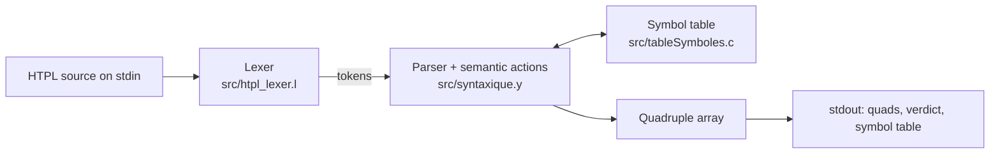

# Compiler architecture

This note explains how `htplc` turns an HTPL program into quadruples. It describes the code in [src/](../src) as it is. For the language itself, see the [language reference](language.md).

## Pipeline



There is a single pass. `main` in [src/syntaxique.y](../src/syntaxique.y) calls `yyparse`, which pulls tokens from the Flex lexer one at a time. The semantic actions attached to the grammar rules fill the symbol table and append quadruples as soon as each construct is recognised. When parsing succeeds, `main` prints the quadruple listing (`printQuad`), the line `Parsing successful`, and the symbol table (`printSymbolTable`).

The [Makefile](../Makefile) builds it in three steps, in this order:

1. `bison -d` turns `syntaxique.y` into `syntaxique.tab.c` and the token header `syntaxique.tab.h`.
2. `flex` turns `htpl_lexer.l` into `lex.yy.c`. It must run after Bison because the lexer includes `syntaxique.tab.h`.
3. `gcc` links both with `tableSymboles.c` into `htplc`.

`make check` runs [tests/run.sh](../tests/run.sh), which compiles [examples/test.htpl](../examples/test.htpl) and every program in [tests/programs/](../tests/programs) and diffs each output against the `.expected` file next to it. The quadruple examples below are taken from [examples/test.expected](../examples/test.expected).

The two earlier milestones in [stages/](../stages) are separate programs: a standalone lexer ([stages/01-lexer](../stages/01-lexer/README.md)) and a hand-written recursive-descent parser ([stages/02-recursive-descent](../stages/02-recursive-descent/README.md)). `htplc` does not use them.

## Lexer

[src/htpl_lexer.l](../src/htpl_lexer.l) matches whole tag openings as single tokens: `<int`, `<assign`, `<if` and so on, plus closing tags such as `</int>` and `</if>`. Attribute syntax (`name`, `=`, string literals, parentheses) and expression operators are separate tokens. `>` is `TOKEN_END_TAG` and `/>` is `TOKEN_SELF_CLOSING_TAG`, which is why comparisons are spelled `>>`, `<<`, `>>=` and `<<=`.

Every rule that returns a token calls `token_action` first. With `htplc -t`, `token_action` prints a `Token: <number>, Content: <lexeme>` line for every token before the quadruples; without `-t` it prints nothing.

Each rule also calls `yysuccess`, which advances the global `currentColumn` by the token length; the newline rule resets it to 1. `%option yylineno` makes Flex count lines in `yylineno`. `yyerror` reports the line and column of the last token read, so the position points just past the construct that failed. It prints `File output, line <l>, character <c> :  <message>` to stdout and calls `exit(1)`, so the first error ends compilation.

## Semantic values

Expression rules (`expr_arithmetique`, `terme`, `facteur`, `expr_logique`, `array_reference`) pass strings up the parse tree: a literal (`3`, `2.500000`, `1` for `true`), a variable name, an array reference such as `numbers[1]`, or the name of a temporary such as `T0`. The quadruples are built from these strings.

Attributes go through the right-recursive `attributes` rule, which collects them into an `AttributeValue`: an array of up to `MAX_ATTRIBUTES` (10) `SingleAttribute` entries, each with a name, a value string and a type. Each alternative calls `prependAttribute` to put its attribute in front of the ones parsed after it, so attribute order is preserved.

- For `name="x"`, `attributes` stores the entry with name `x` and value `"value"`. Declaration actions then read the variable name from `attrs[0].name`.
- For other attributes the entry is the attribute name and its value, so `<assign counter=(counter + 1)/>` gives an entry with name `counter` and value `T5` (the temporary holding the sum), and the `assignment` action reads the target from `attrs[0].name` and the value from `attrs[0].value`.

`<element>` values are collected by the left-recursive `elements` rule into an `elementsArray` of at most `MAX_ELEMENTS` (10) strings, in source order. A tag with more attributes, or an array with more elements, is a compile error.

## Symbol table

[src/tableSymboles.c](../src/tableSymboles.c) and [src/tableSymbole.h](../src/tableSymbole.h) implement a chained hash table (`SymbolTable`, `TABLE_SIZE` = 1000 buckets of `SymbolEntry` lists). Each entry stores only a name and a `DataType` (`TYPE_INTEGER`, `TYPE_FLOAT`, `TYPE_STRING`, `TYPE_BOOLEAN`, `TYPE_ARRAY`, `TYPE_UNDEFINED`). There are no values, scopes, array sizes or element types.

- `hash` is a multiplicative string hash (`h * 31 + c`) reduced modulo `TABLE_SIZE`. `addSymbol` prepends to its bucket, and `printSymbolTable` walks the buckets in index order, so the listing follows hash order (`message`, `counter`, `numbers` for the reference program). Types print in French (`entier`, `flottant`, `chaine`, `booleen`, `tableau`).
- `addSymbol` returns false for a name that is already present. `declareSymbol` in the grammar turns that into a fatal `Variable '<name>' already declared`.
- `findSymbol` is used by the `assignment` action to look up the target. An unknown target gives `Variable '<name>' undefined` (or `Array '<name>' undefined` for an array element).

The declaration actions go through `declareScalar` and `declareArray`, which call `addSymbol`. `declareScalar` and the `assignment` action both call `checkValue`, which checks the value text with `isInteger`, `isFloat`, `isBoolean`, `isString` and `isVariable` according to the target's type. `isVariable` only checks that the text looks like an identifier, so variables and temporaries pass every check except the one for strings, whatever their declared type. Array element targets are not checked.

## Quadruples

A quadruple is a `Quad` struct with four heap-allocated string fields: `op`, `opr1`, `opr2` and `res`. They are stored in the global array `quad[MAX_QUADS]` (1000); the counter `QC` is the index of the next free slot. `createQuad` copies its four strings into `quad[QC]` and increments `QC`; a program that needs more than 1000 quads is a compile error. `printQuad` prints them as `<index>- (op, opr1, opr2, res)`.

| Opcode | Layout | Emitted by | Example from `test.expected` |
|---|---|---|---|
| `:=` | `(:=, value, , target)` | declarations, `assignment`, array elements | `0- (:=, 3, , counter)` |
| `+` `-` `*` `/` | `(op, left, right, temp)` | `expr_arithmetique`, `terme` | `9- (+, numbers[1], 1, T1)` |
| `>` `<` `>=` `<=` `==` | `(op, left, right, temp)` | `expr_logique` (source `>>` becomes `>`, and so on) | `7- (>, counter, 0, T0)` |
| `BZ` | `(BZ, target, , condition)` | `if_condition`, `while_condition` | `8- (BZ, 13, , T0)` |
| `BR` | `(BR, target, , )` | `if_statement` with `<else>`, `while_statement` | `12- (BR, 7, , )` |
| `Bounds` | `(Bounds, 1, size, )` | array declarations | `2- (Bounds, 1, 5, )` |
| `ADEC` | `(ADEC, name, , )` | array declarations | `3- (ADEC, numbers, , )` |
| `PRINT` | `(PRINT, value, , )` | `print_statement` | `6- (PRINT, "Counter initialized to 10", , )` |

`BZ` jumps to `target` when `condition` is zero; `BR` jumps unconditionally. A target equal to the number of quads means "after the last quad" (`19- (BR, 24, , )` in a 24-quad listing). `PRINT` outputs its value: a string literal, a variable, or the temporary holding an expression.

### Temporaries

Every arithmetic operator and every comparison creates a new temporary named `T<n>`, where `n` comes from the global counter `ti`. Temporaries are never reused, and their names are returned as the rule's value so the enclosing rule can use them. A parenthesised expression or a single operand creates no temporary. For `<assign counter=(counter + 1)/>` the reference program gets:

```text
20- (+, counter, 1, T5)
21- (:=, T5, , counter)
```

### Order of declaration quads

`declaration_list` is left-recursive (`declaration_list declaration`), so each declaration's action runs as soon as that declaration is parsed and the quads come out in source order. An array emits `Bounds`, `ADEC`, then one `:=` per initial element, numbered from 1:

```text
2- (Bounds, 1, 5, )
3- (ADEC, numbers, , )
4- (:=, 1, , numbers[1])
5- (:=, 2, , numbers[2])
```

## Back-patching jumps

A jump is emitted before its target is known, then filled in later. The parser keeps the indices of pending jumps on four integer stacks, used through `push` and `pop`: `sauv_begin_if`, `sauv_fin_if`, `sauv_begin_While` and `sauv_cond_While`. Nesting works because each construct pops what it pushed. `patchQuad` writes a jump target into an emitted quad.

The condition is an attribute, so its comparison quads are emitted while `attributes` is parsed, before the `if_condition` or `while_condition` action runs.

### if without else

1. `if_condition` checks that the attribute is called `condition`, pushes `QC` on `sauv_begin_if` and emits `(BZ, , , cond)` with an empty target.
2. The body is parsed and emits its quads.
3. The mid-rule action before `</if>` pops `sauv_begin_if` and writes the current `QC` into that `BZ`'s `opr1`. A false condition skips the body.

### if with else

1. `if_condition` emits the `BZ` as above.
2. After the then-branch, the mid-rule action before `<else>` pushes `QC` on `sauv_fin_if`, emits `(BR, , , )`, then pops `sauv_begin_if` and patches the `BZ` to the current `QC`, the first quad of the else-branch.
3. After the else-branch, the action at `</if>` pops `sauv_fin_if` and patches the `BR` to the current `QC`, so the then-branch jumps over the else-branch.

Bison decides which `if_statement` alternative applies by looking at the token after the then-branch: `</if>` or `<else>`. From the reference program:

```text
13- (==, counter, 0, T2)
14- (BZ, 20, , T2)
15- (-, 3, 1, T3)
16- (:=, T3, , counter)
17- (-, 4, 1, T4)
18- (:=, T4, , counter)
19- (BR, 24, , )
20- (+, counter, 1, T5)
21- (:=, T5, , counter)
22- (+, counter, 1, T6)
23- (:=, T6, , counter)
```

### While loops

1. A mid-rule action right after `<while` pushes `QC` on `sauv_cond_While`: the index of the first quad of the condition.
2. The condition attribute is parsed and emits its comparison quads. `while_condition` then pushes `QC` on `sauv_begin_While` and emits `(BZ, , , cond)`.
3. The body is parsed.
4. The action at `</while>` emits `(BR, <first condition quad>, , )`, then writes the current `QC` into the `BZ`'s `opr1` so a false condition leaves the loop.

Every iteration jumps back to the comparison, so the condition is recomputed:

```text
7- (>, counter, 0, T0)
8- (BZ, 13, , T0)
9- (+, numbers[1], 1, T1)
10- (:=, T1, , numbers[2])
11- (PRINT, "Counter: + counter", , )
12- (BR, 7, , )
```

## Struct definitions shared by the lexer and the parser

The `%union` in [src/syntaxique.y](../src/syntaxique.y) has members of type `AttributeValue` and `elementsArray`. Those types, `SingleAttribute`, and the `MAX_ATTRIBUTES`/`MAX_ELEMENTS` limits are defined once, in the grammar's `%code requires` block. Bison copies that block into the generated `syntaxique.tab.h`, ahead of the union, so [src/htpl_lexer.l](../src/htpl_lexer.l) only includes the header and both files see the same `YYSTYPE`. The block includes [src/tableSymbole.h](../src/tableSymbole.h) for `DataType`. Change these types in the grammar only.
